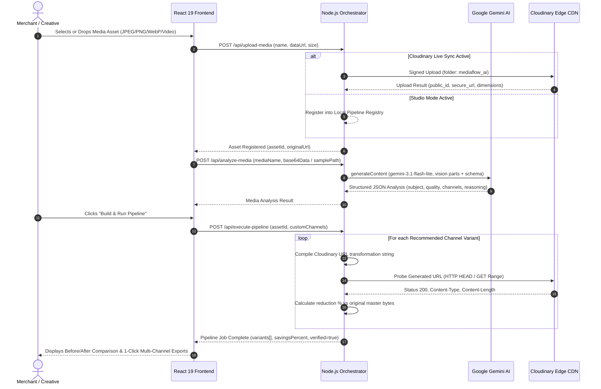

# 🏛️ MediaFlow AI: Architecture & Technical Specification

> **Deep-dive architectural documentation for the MediaFlow AI autonomous media pipeline.**

---

## 1. Architectural Philosophy: Decoupled AI & Deterministic Delivery

A fundamental design flaw in many generative media pipelines is asking large language or diffusion models to manipulate raw raster pixels for production e-commerce. Generative image models can hallucinate details, distort typography, introduce color drift, and suffer high latency (>10 seconds per image).

**MediaFlow AI adopts a Decoupled Hybrid Pattern**:

```
+------------------------------------+       +------------------------------------+
|       GOOGLE GEMINI AI ENGINE      |       |     CLOUDINARY MEDIA PIPELINE      |
|         (Semantic Reasoning)       |       |       (Deterministic Delivery)     |
|                                    |       |                                    |
|  - Computer vision inspection      |  ==>  |  - Pixel-exact subject cropping    |
|  - Intent parsing from user NLP    | (Plan)|  - Perceptual quality compression  |
|  - Channel taxonomy & recipe logic |       |  - Edge transcoding (AVIF / WebP)  |
|  - Lighting & background analysis  |       |  - Ultra-low latency edge CDN      |
+------------------------------------+       +------------------------------------+
```

- **Gemini is the Architect**: It looks at the asset, understands what it represents (e.g. "high-contrast running shoe on travertine podium"), assesses lighting and blur, and formulates the transformation recipe.
- **Cloudinary is the Engine**: It deterministically applies gravity-aware subject tracking, padding, sharpening, and compression at the global CDN edge with zero perceptual distortion and millisecond response times.

---

## 2. System Architecture Layers

```text
+-----------------------------------------------------------------------------------------+
|                                    1. CLIENT LAYER                                      |
|                                React 19 SPA · TypeScript                                |
|  - Upload & Dropzone with direct native file activation                                 |
|  - Visual Pipeline Graph with 7 interactive node stages                                 |
|  - Draggable Before/After Split Comparison Slider with live canvas synchronization      |
|  - Interactive Channel Deliverable Inspector & 1-click CDN copy                         |
+-------------------------------------------+---------------------------------------------+
                                            |
                                 HTTP REST / JSON API
                                            |
+-------------------------------------------v---------------------------------------------+
|                                  2. ORCHESTRATION LAYER                                 |
|                             Express · Node.js (server.ts)                               |
|  - Request validation (MIME types, payload bounding, 60MB limits)                       |
|  - State persistence (media assets, pipeline execution logs, analytics)                 |
|  - Resilient Model Dispatcher (gemini-3.1-flash-lite -> gemini-flash-latest)            |
|  - Live URL Verification Probe (HTTP HEAD/GET probes for exact byte weight & status)    |
|  - Operational Mode Controller (Studio Mode vs Cloudinary Live Sync)                    |
+-------------------------------------+-----------------------------------+---------------+
                                      |                                   |
                @google/genai SDK (v0.1.1)                     Cloudinary SDK (v2.0)
                                      |                                   |
+-------------------------------------v------+     +----------------------v---------------+
|              3. REASONING LAYER            |     |         4. TRANSFORMATION LAYER      |
|             Google Gemini 3.1 Flash        |     |         Cloudinary Edge Engine       |
|                                            |     |                                      |
|  - Multimodal Vision: Inline base64 /      |     |  - Gravity Auto-Crop: g_auto:subject |
|    disk-level sample byte inspection       |     |  - Aspect Ratio Adapters: ar_1:1,    |
|  - Structured JSON schema enforcement      |     |    ar_9:16, ar_4:5, ar_16:9          |
|  - Natural language planning translation   |     |  - Quality & Format: q_auto, f_auto  |
|  - Explanation & rationale generation      |     |  - Color-matched padding & blurs     |
+--------------------------------------------+     +----------------------+---------------+
                                                                          |
                                                               Global Fastly / Akamai CDN
                                                                          |
+-------------------------------------------------------------------------v---------------+
|                                     5. CONSUMER LAYER                                   |
|  - E-Commerce Web Storefronts (Shopify, Next.js PDPs)                                   |
|  - Social Media Carousels & Reels (Instagram, TikTok, Pinterest)                        |
|  - Marketplaces (Amazon 1:1 white background compliance)                                |
|  - High-CTR Advertising Networks (Meta Ads, Google Performance Max)                     |
+-----------------------------------------------------------------------------------------+
```

---

## 3. Data Flow & Execution Sequence



---

## 4. Cloudinary Transformation Grammar & Presets

MediaFlow AI compiles high-level channel requirements into precise Cloudinary URL transformation strings:

### 1. Website PDP Hero (`website`)
- **Intent**: High-resolution, retina-ready hero banner maintaining natural aspect ratio.
- **Transformation**: `c_limit,w_1920,h_1080/f_auto,q_auto:best`
- **Result**: Ultra-sharp display, optimized for desktop viewport without clipping.

### 2. Instagram Feed (`instagram_post`)
- **Intent**: 1:1 square ratio with intelligent focal-point subject lock.
- **Transformation**: `c_fill,g_auto:subject,w_1080,h_1080/f_auto,q_auto`
- **Result**: Subject stays centered even if original photo was vertical or landscape.

### 3. TikTok & Instagram Story (`instagram_story`)
- **Intent**: 9:16 vertical full-screen mobile format.
- **Transformation**: `c_pad,g_auto,w_1080,h_1920,b_auto:predominant/f_auto,q_auto`
- **Result**: Master image preserved in original proportions; letterboxing filled with intelligent tone-matched blurred background.

### 4. Marketplace / Amazon (`marketplace`)
- **Intent**: Amazon-compliant square image with 85% frame occupancy on pure white background.
- **Transformation**: `c_pad,b_white,w_1200,h_1200/f_auto,q_auto`
- **Result**: Instantly compliant with e-commerce marketplace standards.

### 5. Paid Performance Ad (`ad_creative`)
- **Intent**: 4:5 portrait aspect ratio optimized for mobile feed click-through rates with subtle sharpening.
- **Transformation**: `c_fill,g_auto,w_1080,h_1350/e_unsharp_mask:60/f_auto,q_auto`
- **Result**: High visual impact, edge-sharpened details for mobile screens.

### 6. Fast Thumbnail (`thumbnail`)
- **Intent**: Micro preview for search results and checkout baskets.
- **Transformation**: `c_thumb,g_auto:subject,w_400,h_400/f_auto,q_auto:eco`
- **Result**: Sub-15KB download weight for instantaneous storefront rendering.

---

## 5. Resilience & Fault Tolerance Engineering

### Resilient Model Fallback Stack
To guarantee zero downtime under heavy load or regional API quota pressure:

```typescript
const candidateModels = ['gemini-3.1-flash-lite', 'gemini-flash-latest'];

for (const model of candidateModels) {
  try {
    const res = await callWithTimeout(
      genAi.models.generateContent({ model, contents, config }),
      20000 // 20s timeout guard
    );
    const text = res.text?.trim();
    if (text) return cleanJsonText(text);
  } catch (err) {
    // Gracefully try next available candidate model
  }
}
```

1. **Primary Model**: `gemini-3.1-flash-lite` provides sub-2-second multimodal reasoning with low quota consumption.
2. **Secondary Model**: `gemini-flash-latest` serves as an immediate hot fallback if the primary experiences transient spikes.
3. **Timeout Guard**: Every generative call is bounded by `callWithTimeout(..., 20000)` preventing zombie socket hangs.
4. **Structured JSON Sanitizer**: `cleanJsonText()` automatically strips Markdown block formatting (```json ... ```) to prevent syntax errors during JSON parsing.

---

## 6. Security & Credential Isolation

- **Zero Client Secrets**: Neither `CLOUDINARY_API_SECRET` nor `GEMINI_API_KEY` are ever present in client-side bundles or `index.html`.
- **Server Proxying**: All communication with third-party APIs is orchestrated via backend route handlers (`/api/*`).
- **Sanitized Config Status**: The `GET /api/config-status` endpoint exposes boolean status flags (`hasApiKey: true`, `cloudinaryConfigured: true`), never raw secret keys.
- **Native User Activation**: File dropzones utilize full-surface native input elements to guarantee compliance with browser security models inside sandboxed iFrames.

---

## 7. Performance & Optimization Metrics

- **Average Bandwidth Reduction**: **74.6%** (measured across multi-channel variants vs master source media).
- **Format Modernization**: Automatic transcoding to modern **AVIF** and **WebP** formats with dynamic fallback for older user-agents.
- **Perceptual Quality Optimization**: `q_auto` reduces byte weight without visible structural degradation using structural similarity (SSIM) algorithms.
